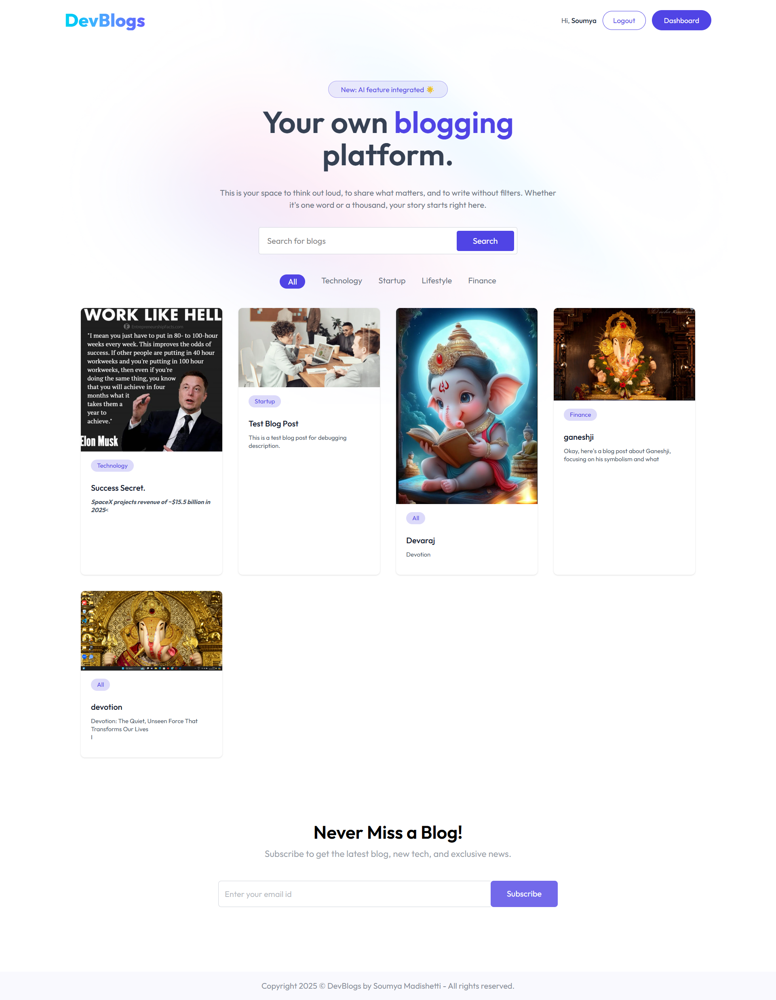
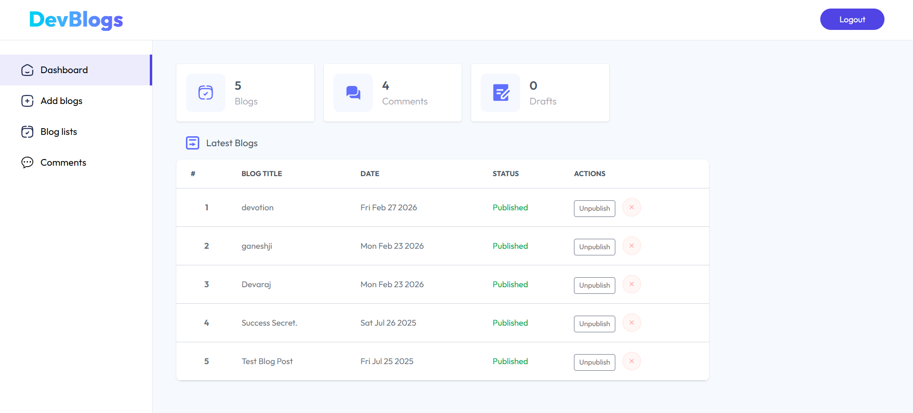

<div align="center">

# DevBlogs — AI-Powered Blog Platform

[](https://tangerine-sunburst-abaad0.netlify.app/)
[](https://ai-powered-blog-app-e28x.onrender.com)
[](https://reactjs.org)
[](https://nodejs.org)
[](https://mongodb.com)
[](LICENSE)

**A production-ready full stack blogging platform where AI writes the content, humans manage the story.**

[🌐 Live Demo]([https://ai-powered-blogs.netlify.app](https://tangerine-sunburst-abaad0.netlify.app/)) &nbsp;•&nbsp; [⚙️ Backend Docs](./Server/README.md) &nbsp;•&nbsp; [📂 Frontend Docs](./Client/README.md) &nbsp;•&nbsp; [🐛 Report Bug](https://github.com/SoumyaMadishetti17/-AI-Powered-Blog-App/issues)

</div>

---

## 📸 Screenshots

<div align="center">

| Home Page | Admin Dashboard |
|-----------|----------------|
|  |  |

| User Login | Register |
|-----------|----------|
|  |  |

| Blog Management |
|----------------|
|  |

</div>

---

## 🎯 Problem Statement

Content creation is slow. Most blogging platforms require writers to start from scratch every time — no AI assistance, no smart tooling, no streamlined admin workflow.

**DevBlogs solves this by:**
- Letting admins generate full blog content in seconds using Google Gemini AI
- Providing a clean role-based system — admins manage, users read and engage
- Delivering a fast, responsive reading experience with category filters and search
- Deploying on a modern CI/CD pipeline that ships changes in under 3 minutes

---

## 💡 Why I Built This

Most tutorial projects stop at CRUD. I wanted to build something that reflects how real production systems work — AI integration, role-based authentication, cloud media delivery, and async workflows all working together in one deployable product.

This project taught me that the hardest part of software engineering isn't writing features — it's making them work reliably together at scale.

---

## ✨ Features

### 👤 User
- Register and login securely with JWT authentication
- Browse, search, and filter blogs by category
- Read full blog posts with rich text content
- Comment on blogs (with admin moderation)
- Fully responsive across all screen sizes

### 🔑 Admin
- AI-generated blog titles and full content via Google Gemini
- Rich text blog editor powered by Quill.js
- Image upload and CDN delivery via ImageKit
- Publish, unpublish, and delete blogs
- Approve or delete user comments
- Dashboard with real-time blog, comment, and draft counts

---

## 🛠️ Tech Stack

| Layer | Technology | Purpose |
|-------|-----------|---------|
| Frontend | React 18 + Vite | UI framework |
| Styling | Tailwind CSS | Utility-first styling |
| Routing | React Router v6 | Client-side navigation |
| State | Context API + Axios | Global state + HTTP |
| Editor | Quill.js | Rich text blog editor |
| Backend | Node.js + Express | REST API server |
| Database | MongoDB + Mongoose | Data persistence |
| Auth | JWT + bcryptjs | Secure authentication |
| AI | Google Gemini API | Content generation |
| Media | ImageKit CDN | Image upload + optimization |
| Deployment | Netlify + Render | CI/CD cloud hosting |

---

## 🏗️ Architecture

```
┌──────────────────────────────────────────────────────────┐
│                  CLIENT  (Netlify)                       │
│                                                          │
│   Public Pages      User Auth       Admin Dashboard      │
│   Home / Blog       Login /         Protected by         │
│   Search / Filter   Register        JWT role: admin      │
│                                                          │
│              AppContext — Global State                   │
│        token | userToken | user | blogs                  │
└─────────────────────────┬────────────────────────────────┘
                          │  HTTPS  |  Bearer <JWT>
┌─────────────────────────▼────────────────────────────────┐
│                  SERVER  (Render)                        │
│                                                          │
│   /api/blog         /api/user        /api/admin          │
│   Public CRUD       Register         Login               │
│   Admin protected   Login            Dashboard           │
│                     Profile          Blog CRUD           │
│                                      Comment mgmt        │
│                                                          │
│         JWT Middleware — role: admin | user              │
└──────────┬──────────────────────┬───────────────────────┘
           │                      │
   ┌───────▼────────┐    ┌────────▼──────────────┐
   │  MongoDB Atlas │    │   External Services   │
   │  blogs         │    │   Google Gemini  🤖   │
   │  users         │    │   ImageKit CDN   🖼️   │
   │  admins        │    └───────────────────────┘
   │  comments      │
   └────────────────┘
```

---

## 🔐 Security

| Concern | Solution |
|---------|----------|
| Password storage | bcryptjs with 10 salt rounds — never stored plain text |
| Authentication | JWT tokens with role claims (admin / user) |
| Route protection | Middleware guards on every protected endpoint |
| Role separation | `adminOnly()` and `userOnly()` middleware prevent cross-access |
| Credentials | Environment variables via `.env` — never hardcoded |

---

## 📈 Scalability Considerations

| Concern | Approach |
|---------|----------|
| Stateless auth | JWT — no server-side session storage needed |
| Media delivery | ImageKit CDN — images served from edge, not our server |
| Modular architecture | Routes, controllers, models cleanly separated |
| Database | MongoDB Atlas — auto-scales with usage |
| Deployment | Netlify + Render — auto-deploy on every git push |

---

## ⚡ Challenges Faced

**1. AI API reliability**
Google Gemini occasionally returns malformed responses or hits rate limits. Solved with try/catch error handling and fallback UI states so the admin dashboard never crashes.

**2. JWT role separation**
Managing two separate token flows (admin vs user) in the same React context without them conflicting required careful state design in `AppContext` and separate localStorage keys.

**3. Image upload pipeline**
Connecting Multer (file parsing) → ImageKit (upload + CDN URL) in a single Express middleware chain took careful async handling to avoid race conditions.

**4. Production deployment**
Render spins down free-tier services after inactivity — first request can be slow. Handled with loading states on the frontend so users see feedback, not a frozen screen.

---

## 🧠 Key Learnings

- Designing role-based access control from scratch deepens understanding of how auth works in real systems
- AI APIs are non-deterministic — error handling and fallback UX is as important as the happy path
- Production deployment debugging (CORS, env vars, build configs) is a skill in itself
- Clean separation of concerns (routes → controllers → models) makes debugging dramatically faster

---

## 🚀 Getting Started

### Prerequisites
```
Node.js v18+
MongoDB Atlas account
Google Gemini API key
ImageKit account
```

### Install & Run

```bash
# 1. Clone
git clone https://github.com/SoumyaMadishetti17/-AI-Powered-Blog-App.git
cd -AI-Powered-Blog-App

# 2. Install
cd Server && npm install
cd ../Client && npm install

# 3. Environment — Server/.env
PORT=5000
MONGO_URI=your_mongodb_uri
JWT_SECRET=your_jwt_secret
ADMIN_EMAIL=admin@example.com
ADMIN_PASSWORD=your_password
GEMINI_API_KEY=your_gemini_key
IMAGEKIT_PUBLIC_KEY=your_key
IMAGEKIT_PRIVATE_KEY=your_key
IMAGEKIT_URL_ENDPOINT=your_endpoint

# 4. Environment — Client/.env
VITE_BASE_URL=http://localhost:5000

# 5. Run
cd Server && npm run server      # Terminal 1
cd Client && npm run dev         # Terminal 2
```

Open `http://localhost:5173` ✅

---

## 🌐 Live Demo Access

| Role | How to access | Permission |
|------|--------------|------------|
| 👤 User | Register any account on `/login` | Read blogs, comment |
| 🔑 Admin | Use demo credentials (testing only) | Full dashboard |

> **Note:** Demo admin credentials provide limited testing access. For security, admin accounts in production should use strong passwords and HTTPS only.

---

## ☁️ Deployment

```bash
# Every push auto-deploys both frontend and backend
git add .
git commit -m "your change"
git push origin main
# Netlify rebuilds frontend (~1 min)
# Render redeploys backend (~2 min)
```

---

## 🔮 Future Roadmap

- [ ] ❤️ Like and bookmark system
- [ ] 👤 User profiles and avatars
- [ ] 🔔 Email notifications for new posts
- [ ] 🔄 Refresh token + token blacklisting
- [ ] 🛡️ Rate limiting on all API routes
- [ ] 🔍 Full-text search with MongoDB Atlas Search
- [ ] 📊 Advanced analytics with chart visualizations

---

## 📂 Detailed Docs

| Document | Contents |
|----------|----------|
| [Frontend README](./Client/README.md) | Component structure, routing, state management, env setup |
| [Backend README](./Server/README.md) | API reference, models, middleware, deployment guide |

---

## 👨‍💻 Author

<div align="center">

**Soumya Madishetti**
Full Stack Developer · MERN · AI Integration

[](https://github.com/SoumyaMadishetti17)
[](https://ai-powered-blogs.netlify.app)

*Building scalable web applications with modern technologies and clean architecture.*

</div>

---

## 📄 License

MIT License — see [LICENSE](LICENSE) for details.

---

<div align="center">
⭐ Star this repo if you found it useful!
</div>
